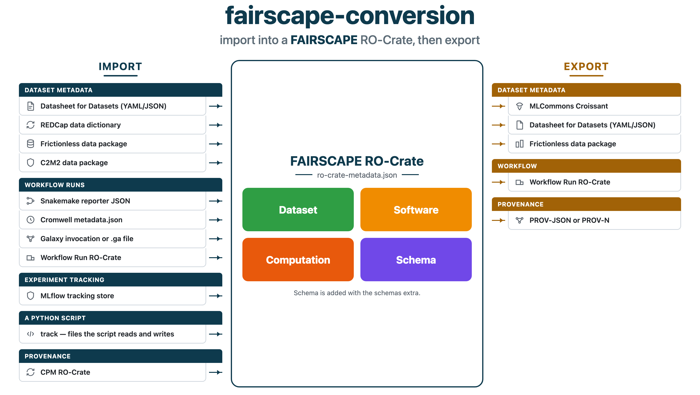

# fairscape-conversion

[](https://pypi.org/project/fairscape-conversion/)
[](https://www.python.org/downloads/)
[](https://github.com/fairscape/fairscape_conversion)

fairscape-conversion converts metadata you already have into a
[FAIRSCAPE](https://fairscape.github.io) RO-Crate
(`ro-crate-metadata.json`), and exports that crate to another format.

This package is the **create** step of FAIRSCAPE, next to
[fairscape_models](https://github.com/fairscape/fairscape_models).
Python 3.10 or newer. Apache-2.0.

## Import and export



Import any file on the left. Export writes that crate as any format on the right, and you choose the format then. The export keeps the part of the crate that format can carry. The command for each format is in [Run a conversion](#run-a-conversion).

## Install

**Recommended:** install the published package from PyPI, with
[uv](https://docs.astral.sh/uv/). That is enough to convert your own files.
The quick start below is the first thing to run.

A clone is a separate path. Use it to run the examples and tests in this
repository, or to use `track` and schema inference from this tree (version
0.2.2) while the [PyPI](https://pypi.org/project/fairscape-conversion/)
release is behind it.

### uv (recommended)

```bash
uv venv
uv pip install fairscape-conversion
uv run python -c "import fairscape_conversion; print('fairscape-conversion is installed')"
```

`uv` creates `.venv` and installs into it. `uv run` uses that environment.
The quick start below shows the uv command and the pip command.

For a single run that keeps no environment on disk, put
`uv run --with fairscape-conversion` in front of that same line.

### pip

pip installs the same PyPI release. Create the virtual environment with
`python3`, the interpreter available before activation. After you activate
it, `python` is the interpreter inside `.venv`, and the later pip examples
use that.

```bash
python3 -m venv .venv              # Windows: py -m venv .venv
source .venv/bin/activate          # Windows: .venv\Scripts\activate
python -m pip install -U pip
python -m pip install fairscape-conversion
```

`.venv/bin/python` (Windows: `.venv\Scripts\python`) is that interpreter
if you call it by path.

A live MLflow tracking store needs the MLflow client as well. On the uv
environment, `uv pip install mlflow`. On the pip environment,
`python -m pip install mlflow`.

### Clone this repository

Clone to run `examples/` or `pytest`, or to install `track` and the `schemas`
extra from this tree. `examples/` ships in the git repository. An editable
install (`-e`) points the environment at the clone, so the examples and tests
run this tree.

`examples/run_all.py` includes `import_mlflow_linked.py`. That example writes
its own MLflow tracking store, then converts it. Install `mlflow` before
`run_all.py`. The `mlflow` package also installs `pandas`, which that
example's `analyze.py` imports.

```bash
git clone https://github.com/fairscape/fairscape_conversion.git
cd fairscape_conversion
```

uv:

```bash
uv venv
uv pip install -e ".[schemas]"
uv pip install pytest
uv pip install mlflow
uv run python examples/run_all.py
uv run python -m pytest
```

pip. Create this environment with `python3` as well, then activate it
before the `python` lines:

```bash
python3 -m venv .venv              # Windows: py -m venv .venv
source .venv/bin/activate          # Windows: .venv\Scripts\activate
python -m pip install -U pip
python -m pip install -e ".[schemas]"
python -m pip install pytest
python -m pip install mlflow
python examples/run_all.py
python -m pytest
```

| Add this on the clone | uv | pip |
|---|---|---|
| Schema inference for Cromwell and MLflow outputs | `uv pip install -e ".[schemas]"` | `python -m pip install -e ".[schemas]"` |
| `import_mlflow_linked.py` and a live MLflow tracking store | `uv pip install mlflow` | `python -m pip install mlflow` |
| The test suite | `uv pip install pytest` | `python -m pip install pytest` |
| The MLflow notebook | `uv pip install mlflow scikit-learn pandas jupyter` | `python -m pip install mlflow scikit-learn pandas jupyter` |

The `schemas` extra adds the readers for tabular and scientific files (CSV,
Parquet, HDF5, and others). MLflow is its own package.

## Quick start

Convert a small datasheet. Do this after the PyPI install above.

Write the file and the output folder:

```bash
cat > datasheet.yaml << 'EOF'
name: example-dataset
title: Example dataset
description: A small datasheet, to try the converter.
license: CC0-1.0
EOF

mkdir -p my-crate
```

Run the conversion.

uv:

```bash
uv run python -m fairscape_conversion.core.cli convert d4d import datasheet.yaml my-crate/ro-crate-metadata.json
```

pip, after `source .venv/bin/activate`:

```bash
python -m fairscape_conversion.core.cli convert d4d import datasheet.yaml my-crate/ro-crate-metadata.json
```

The command prints `wrote my-crate/ro-crate-metadata.json`.

The same call from Python:

```python
import yaml
from fairscape_conversion.plugins import d4d

with open("datasheet.yaml") as handle:
    crate = d4d.convert("import", yaml.safe_load(handle))
```

A full Datasheet for Datasets ships inside the package:

```python
from importlib.resources import files
import yaml
from fairscape_conversion.plugins import d4d

text = files("fairscape_conversion.plugins.d4d").joinpath("input.yaml").read_text()
crate = d4d.convert("import", yaml.safe_load(text))
```

In this repository that file is [`plugins/d4d/input.yaml`](plugins/d4d/input.yaml).

## Run a conversion

Run these from the repository root, after the
[clone install](#clone-this-repository). They read samples that are already
in the tree, or a crate one of these commands just wrote, and they write the
results under `out/`. A successful command prints `wrote` and the path.
Delete `out/` when you are finished looking.

Create the folder first. The write needs the folder to exist, and running a
command again overwrites the file.

```bash
mkdir -p out
```

The commands start with `uv run`, matching the uv clone install. With `.venv`
activated for the pip install, run the same line from `python` onward.

```bash
uv run python -m fairscape_conversion.core.cli convert FORMAT import INPUT OUTPUT
uv run python -m fairscape_conversion.core.cli convert FORMAT export INPUT OUTPUT
```

| Word | What you type |
|---|---|
| `FORMAT` | `d4d`, `snakemake`, `galaxy`, `redcap`, `frictionless`, `wrroc`, `cpm`, `croissant`, or `mlflow` |
| `import` | Read `INPUT` and write a FAIRSCAPE RO-Crate |
| `export` | Read a FAIRSCAPE RO-Crate and write the other format |
| `INPUT` | A sample path in this section, or a file of your own in that same place |
| `OUTPUT` | A path under `out/`. Leave it off and the JSON is printed |

A name ending in `.yaml` or `.yml` is YAML. Any other name is JSON.

C2M2 and Cromwell are the Python calls later in this section. C2M2 writes a
folder, and `output_path` chooses it. Cromwell takes the path of a
`metadata.json`. A live MLflow store is the Python call in
[MLflow](#mlflow). The MLflow sample file itself goes through the command
above.

Add a flag after `OUTPUT` when you need one:

| Flag | Add it when |
|---|---|
| `--records FILE` | Importing REDCap, and you have the record-export CSV as well as the data dictionary |
| `--provn` | Exporting CPM as PROV-N. The usual CPM export is PROV-JSON |
| `--link-crate DIR` | An upstream crate already describes inputs of this run. Repeat the flag for another crate. `DIR` contains `ro-crate-metadata.json` |
| `--crate-dir DIR` | Relative paths in this crate should resolve from `DIR` |

`track` and `link` are separate commands, in the sections below.

### One Snakemake run, five files

`plugins/snakemake/input.json` is the record of a finished Snakemake run. The
run writes `letters.txt`, reverses that file, and splits the result in half.
Import the record, then export the crate. Snakemake has already run. These
commands read the record.

```bash
uv run python -m fairscape_conversion.core.cli convert snakemake import \
  plugins/snakemake/input.json \
  out/snakemake-ro-crate.json

uv run python -m fairscape_conversion.core.cli convert d4d export \
  out/snakemake-ro-crate.json out/snakemake-datasheet.yaml

uv run python -m fairscape_conversion.core.cli convert frictionless export \
  out/snakemake-ro-crate.json out/snakemake-datapackage.json

uv run python -m fairscape_conversion.core.cli convert wrroc export \
  out/snakemake-ro-crate.json out/snakemake-workflow-run.json

uv run python -m fairscape_conversion.core.cli convert cpm export \
  out/snakemake-ro-crate.json out/snakemake-prov.json

uv run python -m fairscape_conversion.core.cli convert croissant export \
  out/snakemake-ro-crate.json out/snakemake-croissant.json
```

Each line prints `wrote` and the output path.

List what landed in the crate:

```bash
uv run python - << 'PY'
import json
crate = json.load(open("out/snakemake-ro-crate.json"))
print("computations")
for node in crate["@graph"]:
    kind = node.get("@type", "")
    if isinstance(kind, list):
        kind = " ".join(kind)
    if "Computation" in kind:
        print(" ", node.get("name"))
print("files")
for node in crate["@graph"]:
    name = node.get("name") or ""
    if name.endswith(".txt"):
        print(" ", name)
PY
```

That prints:

```
computations
  Snakemake workflow run of 'Snakefile'
  make_list
  reverse
  split_halves
files
  first_half.txt
  letters.txt
  reversed.txt
  second_half.txt
```

Each export reads that same crate and keeps the part its format can carry.

| File | What you should find |
|---|---|
| `out/snakemake-datasheet.yaml` | A datasheet titled `Snakemake workflow 'Snakefile'`, with the description and the keywords |
| `out/snakemake-datapackage.json` | A Frictionless data package named `snakemake-workflow-snakefile`. The four text files are the resources |
| `out/snakemake-workflow-run.json` | A Workflow Run RO-Crate. Each of the four jobs is a `CreateAction` |
| `out/snakemake-prov.json` | PROV-JSON for the run: 4 activities and 9 entities |
| `out/snakemake-croissant.json` | Croissant metadata for the workflow. The four text files are distributions |

### Datasheet — `d4d`

Use this for a Datasheet for Datasets, in YAML or JSON. The sample is the
AI-READI datasheet shipped with the package.

```bash
uv run python -m fairscape_conversion.core.cli convert d4d import \
  plugins/d4d/input.yaml \
  out/aireadi-ro-crate.json

uv run python -m fairscape_conversion.core.cli convert d4d export \
  out/aireadi-ro-crate.json \
  out/aireadi-datasheet.yaml
```

The crate's dataset is Artificial Intelligence Ready and Equitable Atlas for
Diabetes Insights (AI-READI). The exported datasheet opens with that title and
the id `https://fairhub.io/datasets/2`.

On a datasheet of your own, use that path in place of `plugins/d4d/input.yaml`.

### Snakemake — `snakemake`

Use this when a Snakemake workflow has already finished and you want that run
as a FAIRSCAPE RO-Crate. Snakemake runs the pipeline. This package reads the
JSON that `snakemake --reporter fairscape` writes about that run. Install
`snakemake-report-plugin-fairscape` beside Snakemake for the reporter. The
reporter reads the finished run and writes the jobs, the rules, and the files.

The tour above converts the small sample,
[`plugins/snakemake/input.json`](plugins/snakemake/input.json).

A larger sample is the variant-calling run. The same import:

```bash
uv run python -m fairscape_conversion.core.cli convert snakemake import \
  examples/snakemake-variant-calling/run/records.json \
  out/variant-calling-ro-crate.json
```

That crate has 13 computations: `bwa_map` on samples A, B, and C,
`samtools_sort`, `samtools_index`, `bcftools_call`, `plot_quals`, and
`variant_summary`, plus the workflow run itself. The datasets include the
FASTQ reads, the BAM files, and `all.vcf`.

On a run of your own, point that import at the JSON the reporter wrote.

### Galaxy — `galaxy`

Use this when you have Galaxy's own export of a run, or a `.ga` workflow
file. The export is the archive or folder Galaxy writes for an invocation
(`.tar.gz`, `.zip`, or the unpacked folder).

The sample invocation is the folder
[`plugins/galaxy/input-store`](plugins/galaxy/input-store).

```bash
uv run python -m fairscape_conversion.core.cli convert galaxy import \
  plugins/galaxy/input-store \
  out/galaxy-ro-crate.json
```

The crate has seven computations: the invocation, three uploads, a merge,
`cat_collection`, and `head`. The datasets include `hello`, `world`, and
`universe`.

The `.ga` file is the workflow definition, the software for that same
workflow:

```bash
uv run python -m fairscape_conversion.core.cli convert galaxy import \
  plugins/galaxy/input-store/workflows/2154bc930d1891d1.ga \
  out/galaxy-workflow.json
```

The software nodes are `collection_workflow`, `__MERGE_COLLECTION__`,
`cat_collection`, and `head`.

Galaxy can also publish the same run as a Workflow Run RO-Crate. That file
is `ro-crate-metadata.json`. Convert that one with
[Workflow Run RO-Crate](#workflow-run-ro-crate--wrroc), below.

### REDCap — `redcap`

Import the data dictionary CSV. Add `--records` when you also have the
project's record export. Both samples are in the tree.

```bash
uv run python -m fairscape_conversion.core.cli convert redcap import \
  plugins/redcap/input-dictionary.csv \
  out/redcap-ro-crate.json \
  --records plugins/redcap/input-records.csv
```

The crate has one computation, `REDCap export from project 'input-dictionary'`,
both CSVs as datasets, and a schema for the record export.

On a project of your own, use your dictionary path and your records path in
those two places.

### Frictionless — `frictionless`

Import a `datapackage.json`, or the folder that contains it. The sample is
county respiratory-illness surveillance for the 2025-26 season.

```bash
uv run python -m fairscape_conversion.core.cli convert frictionless import \
  plugins/frictionless/input-datapackage \
  out/frictionless-ro-crate.json

uv run python -m fairscape_conversion.core.cli convert frictionless export \
  out/frictionless-ro-crate.json \
  out/frictionless-datapackage.json
```

The crate carries the package, the resource tables, and a schema for
`cases_by_county` and for `counties`. The export is the data package again:
name `county-respiratory-surveillance-2026`, resources `cases_by_county`,
`counties`, and `methods`.

On a package of your own, use that folder in place of
`plugins/frictionless/input-datapackage`.

### C2M2 — `c2m2`

Import a CFDE C2M2 datapackage folder. The call writes a crate folder and
copies the source tables into it. `output_path` chooses the folder, here
`out/c2m2-crate`.

```bash
uv run python - << 'PY'
from fairscape_conversion.plugins import c2m2

c2m2.convert(
    "import",
    "plugins/c2m2/input-datapackage",
    output_path="out/c2m2-crate",
)
print("wrote out/c2m2-crate/ro-crate-metadata.json")
PY
```

The folder holds `ro-crate-metadata.json` and the C2M2 tables (`project.tsv`,
`file.tsv`, `biosample.tsv`, and the others). The sample is the Mini Project
package: a schema for each table, and one biosample.

### Workflow Run RO-Crate — `wrroc`

Use this when the run is already a Workflow Run RO-Crate: a
`ro-crate-metadata.json` published by CWL, by Galaxy's RO-Crate export, or by
another engine. Import turns that crate into a FAIRSCAPE RO-Crate. Export
writes a FAIRSCAPE RO-Crate back out in that same profile.

For Galaxy's invocation archive or a `.ga` file, use
[Galaxy](#galaxy--galaxy).

The sample is a CWL run:

```bash
uv run python -m fairscape_conversion.core.cli convert wrroc import \
  plugins/wrroc/input.json \
  out/wrroc-ro-crate.json
```

The computations are the workflow `packed.cwl`, its `rev` step, and its
`sorted` step. The datasets include `whale.txt`.

Export of a crate you already have is the tour command that writes
`out/snakemake-workflow-run.json`. The same command on another crate replaces
`out/snakemake-ro-crate.json` with that crate's `ro-crate-metadata.json`.

### CPM — `cpm`

Import the crate directory. The PROV files sit beside `ro-crate-metadata.json`,
so the input is that directory. The sample is a model-training provenance
graph.

```bash
uv run python -m fairscape_conversion.core.cli convert cpm import \
  plugins/cpm/input-crate \
  out/cpm-ro-crate.json

uv run python -m fairscape_conversion.core.cli convert cpm export \
  out/cpm-ro-crate.json \
  out/cpm-prov.json

uv run python -m fairscape_conversion.core.cli convert cpm export \
  out/cpm-ro-crate.json \
  out/cpm-prov.provn \
  --provn
```

The crate has nine computations, from preprocessing and training
(`trainIter0`, `trainIter1`, `trainIter2`) through testing. The first export
is PROV-JSON. `--provn` writes PROV-N, and that file opens with `document`.

On a CPM crate of your own, use that directory in place of
`plugins/cpm/input-crate`.

### Croissant — `croissant`

Export a FAIRSCAPE RO-Crate as MLCommons Croissant. The sample crate is the
Mini Project C2M2 package.

```bash
uv run python -m fairscape_conversion.core.cli convert croissant export \
  plugins/croissant/input.json \
  out/croissant.json
```

The Croissant document is named `Mini_Project` and has six record sets, one
for each C2M2 table schema. The tour file `out/snakemake-croissant.json` is
this same export on the Snakemake crate, where the four text files are
distributions.

On a crate of your own, use its `ro-crate-metadata.json` in place of
`plugins/croissant/input.json`.

### Cromwell

Use this when Cromwell has finished a WDL workflow and you want that run as a
FAIRSCAPE RO-Crate. Cromwell runs the workflow and writes the record. This
package reads that record.

Save the metadata as Cromwell runs:

```bash
cromwell run -m metadata.json workflow.wdl inputs.json
```

The same JSON is the response from Cromwell's workflow metadata API. The
sample in this repository is the variant-calling run, the same analysis as
the Snakemake example above, executed by Cromwell. Pass that path as a string
and write the crate file:

```bash
uv run python - << 'PY'
import json
from pathlib import Path
from fairscape_conversion.plugins import cromwell

crate = cromwell.convert(
    "import",
    "examples/wdl-variant-calling/run/metadata.json",
    crate_dir="out/cromwell-crate",
)
Path("out/cromwell-crate/ro-crate-metadata.json").write_text(
    json.dumps(crate, indent=2)
)
print("wrote out/cromwell-crate/ro-crate-metadata.json")
PY
```

`out/cromwell-crate` then holds `ro-crate-metadata.json`, the submitted
`VariantCalling.wdl`, and `inputs.json`. The crate has 13 computations: the
workflow, `BwaMem` on three shards, `SamtoolsSort`, `SamtoolsIndex`,
`BcftoolsCall`, `PlotQuals`, and `VariantSummary`.

On a run of your own, use the path of that `metadata.json` as the second
argument. The function opens the file and reads each task.

### MLflow

Use this when runs were already tracked in MLflow and you want those runs as
a FAIRSCAPE RO-Crate. MLflow recorded the experiment. This package reads the
record.

The sample is the extracted record of an experiment named `iris-classifier`:

```bash
uv run python -m fairscape_conversion.core.cli convert mlflow import \
  plugins/mlflow/input.json \
  out/mlflow-ro-crate.json
```

The computations are `rf-train` and `rf-depth-2`. The datasets are `iris`,
`confusion_matrix.csv`, and `notes.txt`, and the iris columns are a schema.

A tracking store you already have is a Python call. Install `mlflow` first
([Install](#install)). The store is a string: a `sqlite:///` URI built from
the database path, or the path of a directory of runs. Replace `NAME` with
the experiment name or its id. The call below writes the crate file.
`copy_artifacts=False` leaves artifacts in the store. Passing no
`copy_artifacts` argument copies them into `out/mlflow-crate`.

```python
import json
from pathlib import Path
from fairscape_conversion.plugins import mlflow

uri = "sqlite:///" + str(Path("mlflow.db").resolve())
crate = mlflow.convert(
    "import",
    uri,
    experiment="NAME",
    crate_dir="out/mlflow-crate",
    copy_artifacts=False,
)
Path("out/mlflow-crate").mkdir(parents=True, exist_ok=True)
Path("out/mlflow-crate/ro-crate-metadata.json").write_text(
    json.dumps(crate, indent=2)
)
```

Pass `run_id="..."` to export one run and its nested children.

## Track a Python run

Use `track` when the run is a Python script you are about to execute, and you want the files it reads and writes in a crate. Snakemake, Cromwell, Galaxy, and MLflow are for runs those tools have already recorded. `track` runs the script itself and appends that run to a crate.

`track` is in this repository (0.2.2). Install from a [clone](#clone-this-repository) first.

The command is:

```bash
python -m fairscape_conversion.core.cli track SCRIPT --crate-dir DIR -- SCRIPT_ARGS
```

Everything after `--` is passed to the script. With uv, put `uv run` in front
of `python`. This creates a script, a small input, and records the run:

```bash
mkdir -p data my-crate
printf 'raw\n' > data/raw.csv
cat > clean.py << 'EOF'
import sys
src, dst = sys.argv[1], sys.argv[2]
open(dst, "w").write(open(src).read().upper())
EOF

python -m fairscape_conversion.core.cli track clean.py --crate-dir my-crate -- data/raw.csv data/clean.csv
```

The command prints the computation it recorded, such as one input and one
output. The crate is `my-crate/ro-crate-metadata.json`. The script is copied
to `software/clean-<hash>.py` inside that directory. Run `track` again to
append another computation. An input the crate already describes reuses that
node.

| Flag | What you add |
|---|---|
| `--input FILE` | A file the capture misses. Repeat the flag for another file |
| `--link-crate DIR` | An upstream crate whose entities this run's inputs reuse |
| `--name TEXT` | Label for the run. The default is the script's file name |
| `--author TEXT` | Author. The default is the crate's author, or your username |
| `--keyword TEXT` | A keyword. Repeat the flag for another |
| `--start-clean` | Drop previous runs from the crate, then add this one |

The capture records `open` and `pathlib`. It also records pandas, numpy, and
matplotlib when those packages are installed. A script that reads and writes
no files prints `no file I/O detected; nothing was recorded`.

In Jupyter, from that same clone environment:

1. Load the extension.

```python
%load_ext fairscape_conversion.plugins.python
```

2. Run a cell that reads or writes a file. The cell is recorded in `my-crate`.

```python
%%fairscape track --crate-dir my-crate --name normalize
df = pd.read_csv("raw.csv")
df.to_csv("normalized.csv")
```

A cell that reads or writes nothing is left out of the crate.

## Link two crates

Use this when files this run reads are outputs another crate already
describes. `--link-crate` takes the directory that contains
`ro-crate-metadata.json`.

During a conversion, add the flag after `OUTPUT`:

```bash
python -m fairscape_conversion.core.cli convert snakemake import records.json ro-crate-metadata.json \
    --link-crate /path/to/upstream-crate
```

On a crate already written, run `link`. Add `-o OUT` to write a new file and
leave the original in place:

```bash
python -m fairscape_conversion.core.cli link ./crate-dir --link-crate /path/to/upstream-crate
```

Repeat `--link-crate` for another upstream crate. The command prints how many
inputs matched. With `convert` and no `--crate-dir`, relative paths resolve
from the output file's folder.

From Python, pass the same directory as `linked_crates`:

```python
from fairscape_conversion.plugins import mlflow

mlflow.convert(
    "import",
    "./mlruns",
    experiment="NAME",
    linked_crates=["/path/to/upstream-crate"],
)
```

From a clone, two worked pairs are already wired up. Run them from the
repository root. Install `mlflow` before `import_mlflow_linked.py`. That
example writes a tracking store and converts it.

uv:

```bash
uv pip install mlflow
uv run python examples/import_snakemake_linked.py
uv run python examples/import_mlflow_linked.py
```

pip, with `.venv` active:

```bash
python -m pip install mlflow
python examples/import_snakemake_linked.py
python examples/import_mlflow_linked.py
```

In
`examples/linked-crates/nextflow-run`, `ro-crate-metadata.json` is under
`results/`. The write-up is
[`examples/linked-crates/`](examples/linked-crates).

## Examples

Run these from the repository root, after the
[clone install](#clone-this-repository). Install `mlflow` before
`run_all.py`. The run includes `import_mlflow_linked.py`, which writes an
MLflow tracking store and converts it.

uv:

```bash
uv pip install mlflow
uv run python examples/import_d4d.py
uv run python examples/run_all.py
```

pip, with `.venv` active:

```bash
python -m pip install mlflow
python examples/import_d4d.py
python examples/run_all.py
```

`import_d4d.py` converts the datasheet shipped in the package and writes
`examples/out/d4d/`. `run_all.py` runs every example and prints pass or fail
for each one. Output goes to `examples/out/`.

The list of every script, including public Cromwell and Galaxy runs, is
[`examples/README.md`](examples/README.md).

[`examples/mlflow/mlflow_to_rocrate.ipynb`](examples/mlflow/mlflow_to_rocrate.ipynb)
trains a model and converts the store it wrote. The notebook also runs
`fairscape-cli`, which is a separate package, and it needs `mlflow`,
`scikit-learn`, `pandas`, and `jupyter`.

## Tests

From the clone.

uv:

```bash
uv pip install pytest
uv run python -m pytest
```

pip, with `.venv` active:

```bash
python -m pip install pytest
python -m pytest
```

Parity tests compare a few converters with the original implementations and
skip when those trees are not checked out beside this one.

## Add a format

A converter is a folder of two CSV mapping files and a small plugin class.
Copy [`plugins/example/`](plugins/example/) and follow
[`docs/NEW-PLUGIN.md`](docs/NEW-PLUGIN.md). The column reference is
[`MAPPING-SCHEMA.md`](MAPPING-SCHEMA.md). How a conversion runs is
[`docs/INTERNALS.md`](docs/INTERNALS.md).

## License

Apache-2.0.
